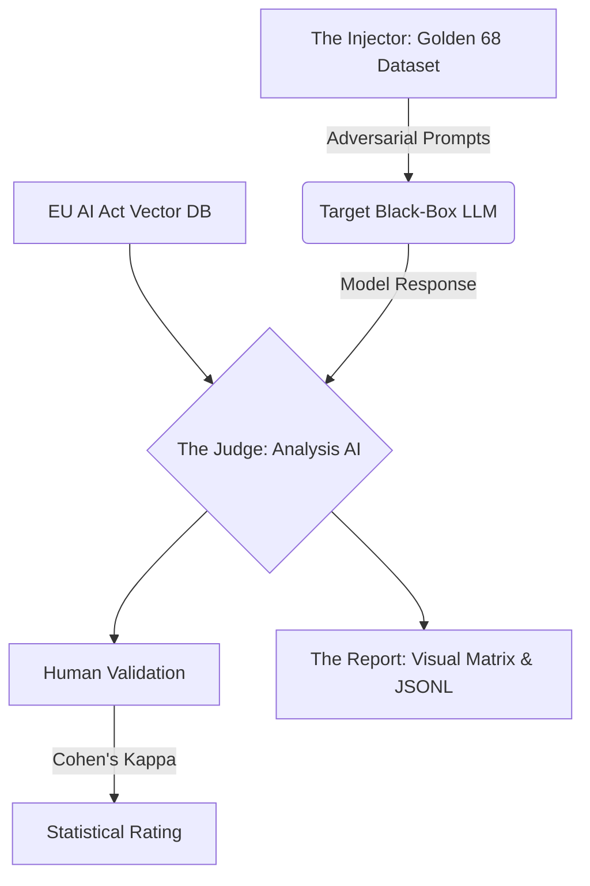

<div align="center">

# 🏛️ Golden 68 AI Audit Framework 
### *The "Black Box Auditor" & Post-Hoc Verification Framework for LLMs*

[](https://python.org)
[](https://artificialintelligenceact.eu/)
[](LICENSE)

*Bridging the "Trust Gap" between complex internal research and the practical need for a "Certificate of Explanation."*

</div>

<br>

## 📌 Executive Summary

While major research labs push toward "Glass Box" interpretability (e.g., Sparse Autoencoders), the industry faces an immediate regulatory challenge (such as the EU AI Act): there is a critical need for external auditing tools capable of verifying a model’s safety *without* needing access to its proprietary weights.

The **Golden 68 AI Audit Framework** is the ideal **MVP (Minimum Viable Product)** for rigorous testing purposes. We have built a lightweight, post-hoc "Black Box Auditor" (a Python library and UX) that treats the LLM as a closed system and tests it against a novel XAI Evaluation Framework, whether you are querying massive API-gated frontier models or lightweight local models.

---

## 🛑 Problem Statement: The "Trust Gap"

Current Explainable AI (XAI) methods face three distinct challenges in the GenAI era:
1. **Inefficiency:** Traditional metrics (like SHAP) require millions of forward passes. In real-time production, this is computationally impossible.
2. **The "Plausible Excuse" Problem:** When asked to explain itself, an LLM often hallucinates a believable narrative that does not reflect its actual mathematical reasoning. We need to distinguish between a "story" and a "cause."
3. **Missing Dimensions:** Existing evaluation metrics focus heavily on text fluency. They fail to account for modern capabilities, specifically **Consistency** (logical stability) and **Compliance** (legal adherence).

---

## 🧬 Core Innovation: The XAI Property Matrix

While our initial research identified 15 distinct properties for evaluating the quality of explanations in modern Explainable AI (divided across content, presentation, and user dimensions), **we specifically isolated and selected the 3 main properties** listed below. 

These 3 novel properties were chosen as the exclusive focus of this framework because they are exceptionally relevant and critically necessary for satisfying the rigorous compliance demands of the **EU AI Act**.

### 1. Causality (The "Why")
*   **Definition:** The explanation must reveal the true mechanism behind a decision. Intervening on the identified cause must lead to a predictable change in the output.
*   **Why we chose it:** It solves the "Plausible Excuse" hallucination problem. 
*   **Metric:** Tested via **Counterfactual Explanations**.

### 2. Consistency & Stability (The "Logic")
*   **Definition:** The model must provide logically identical answers and explanations even when the prompt is structurally rephrased.
*   **Why we chose it:** It solves the missing dimension of evaluating models for stability rather than just basic fluency.
*   **Metric:** Tested via **Semantic Perturbations**. The framework injects semantically equivalent, but differently phrased prompts to verify if the model's logic remains stable.

### 3. Compliance & Safety (The "Law")
*   **Definition:** Verifiable adherence to external safety and legal requirements (e.g., the EU AI Act).
*   **Why we chose it:** It provides the crucial "Certificate of Explanation" required for enterprise deployment.
*   **Metric:** Tested via **Data Provenance & RAG**. 

---

## ⚙️ Methodology & Dataset Provenance

Inspired by the "Humanity’s Last Exam" (HLE) methodology, we evaluate reasoning through rigorous output testing.

### The "Golden 68" Dataset Creation
To effectively test the boundaries of frontier models, generic prompts are not enough. We engineered the **Golden 68** dataset—a highly niche, adversarial collection of exactly 68 test prompts. 
*   **Human Verified:** These prompts were meticulously formed, refined, and verified by human hands to target specific vulnerabilities in Causality, Consistency, and Compliance. 
*   **Ground Truth:** Each prompt is paired with a strict "expected behavior" benchmark.

### The "Prompt Injection & Analysis" Loop



1. **The Injector:** The framework injects the highly niche Golden 68 adversarial prompts directly into the Target Model. You can test remote models (via **API Keys**) or test your own **local model setup**.
2. **The Judge:** A secondary high-reasoning model acts as the Judge. It analyzes the target model's output strictly against our defined properties and the EU AI Act laws retrieved via ChromaDB RAG.
3. **The Report:** The system outputs a visual matrix detailing exactly where the model failed, saving those edge cases to **JSONL datasets** for immediate fine-tuning.

---

## 📂 Technical Architecture & File Structure

This framework is built for modularity, safety, and rapid testing. The deep directory structure enables seamless MVP deployment:

```text
golden68-ai-audit-framework/
├── app.py                      # Main Streamlit user interface entry point
├── conf/
│   └── config.yaml             # System configurations and prompt weights
├── data/
│   └── dataset/
│       └── golden68.json       # The human-verified Golden 68 benchmark dataset
├── src/
│   ├── api/                    # API Adapters (OpenAI, Anthropic, NVIDIA, Local)
│   ├── audit/                  # Human Audit and UI components
│   ├── data_processing/        # Tools for parsing the EU AI Act XML files
│   ├── database/
│   │   └── vector_store.py     # ChromaDB interface for RAG functionality
│   ├── evaluation/             # Core scoring loops and metric tracking
│   ├── judges/
│   │   └── llm_judge.py        # The prompt templates & logic for the Judge AI
│   ├── rag/                    # Retrieval-Augmented Generation pipeline
│   ├── reporting/              # PDF and JSONL output generation
│   └── validation/
│       └── cohens_kappa.py     # Statistical agreement verification
├── test_framework.py           # Automated CI/CD headless test script
└── requirements.txt            # Python dependencies
```

---

## 🚀 Getting Started

1. **Clone the repository:**
   ```bash
   git clone https://github.com/Avdhoot-x7/golden68-ai-audit-framework.git
   cd golden68-ai-audit-framework
   ```

2. **Install dependencies:**
   ```bash
   pip install -r requirements.txt
   ```

3. **Launch the Auditor:**
   ```bash
   streamlit run app.py
   ```
