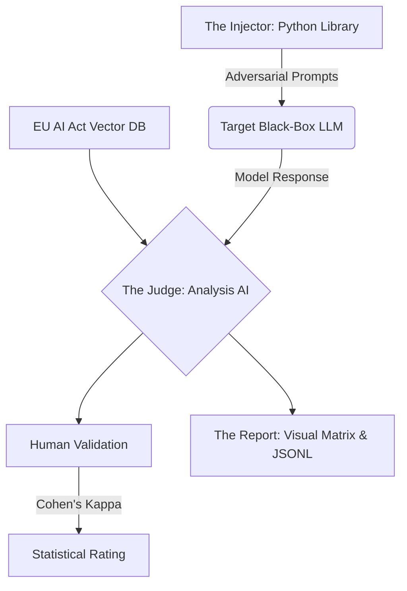

<div align="center">

# 🏛️ Golden 68 AI Audit Framework 
### *The "Black Box Auditor" & Post-Hoc Verification Framework for LLMs*

[](https://python.org)
[](https://artificialintelligenceact.eu/)
[](LICENSE)

*Bridging the "Trust Gap" between complex internal research and the practical need for a "Certificate of Explanation."*

</div>

<br>

## 📌 Executive Summary

While major research labs push toward "Glass Box" interpretability (e.g., Sparse Autoencoders), the industry faces an immediate regulatory challenge (such as the EU AI Act): there is a critical need for external auditing tools capable of verifying a model’s safety *without* needing access to its proprietary weights.

The **Golden 68 AI Audit Framework** is a Post-Hoc Verification Framework. We have built a "Black Box Auditor" (a Python library and UX) that treats the LLM as a closed system and rigorously tests it against a novel **XAI Evaluation Framework**.

---

## 🛑 Problem Statement: The "Trust Gap"

Current Explainable AI (XAI) methods face three distinct challenges in the GenAI era:
1. **Inefficiency:** Traditional metrics (like SHAP) require millions of forward passes. In real-time production, this is computationally impossible.
2. **The "Plausible Excuse" Problem:** When asked to explain itself, an LLM often hallucinates a believable narrative that does not reflect its actual mathematical reasoning. We need to distinguish between a "story" and a "cause."
3. **Missing Dimensions:** Existing evaluation metrics focus heavily on text fluency. They fail to account for modern capabilities, specifically **Agency** (AI taking actions) and **Compliance** (legal adherence).

---

## 🧬 Core Innovation: The 15 Properties of XAI

We have identified and noted 15 main properties for evaluating the quality of explanations in modern Explainable AI (XAI). These properties are traditionally divided into content, presentation, and user dimensions [1]:

1. **Correctness & Faithfulness**
2. **Completeness**
3. **Consistency & Stability**
4. **Continuity**
5. **Contrastivity**
6. **Covariate Complexity**
7. **Compactness**
8. **Compositionality**
9. **Confidence**
10. **Context**
11. **Coherence**
12. **Controllability**
13. **Causality**
14. **Agency**
15. **Compliance & Safety**

### Our Focus: The Modern Trinity (Properties 13, 14, 15)

While the first 12 properties (Correctness, Consistency, Coherence, etc.) are standard metrics heavily focused on basic fluency and text correctness, **our primary research contribution is the formal operationalization of the three novel properties (13, 14, and 15)**. 

Out of the 15 properties, we specifically chose to focus our auditing framework on these main three because they address the critical, missing dimensions required for modern, high-stakes Agentic systems to survive in a regulated world:

#### 13. Causality (The "Why")
*   **Definition:** The explanation must reveal the true mechanism behind a decision. Intervening on the identified cause must lead to a predictable change in the output.
*   **Why we chose it:** It solves the "Plausible Excuse" hallucination problem. 
*   **Metric:** Tested via **Counterfactual Explanations**. If a model claims it rejected a prompt due to a specific rule, the tool injects a counterfactual prompt to see if the decision flips, proving causality over hallucination.

#### 14. Agency (The "Action")
*   **Definition:** For Agentic AI, the system must transparently explain its multi-step workflows.
*   **Why we chose it:** It solves the missing dimension of evaluating models that *take actions* rather than just generating text.
*   **Metric:** Implemented via **Audit Trails**. The tool forces the model to log every decision step, verifying if the final action strictly matches the internal logic.

#### 15. Compliance & Safety (The "Law")
*   **Definition:** Verifiable adherence to external safety and legal requirements (e.g., the EU AI Act).
*   **Why we chose it:** It provides the crucial "Certificate of Explanation" required for enterprise deployment.
*   **Metric:** Tested via **Data Provenance & RAG**. Leveraging ChromaDB, the framework injects strict regulatory laws and evaluates if the model's generated output conforms to the indexed legal structures.

---

## ⚙️ Methodology: The "Prompt Injection & Analysis" Loop

Inspired by the "Humanity’s Last Exam" (HLE) methodology, we evaluate reasoning through rigorous output testing rather than internal inspection. 



### 1. The Injector (Python Library)
The core library generates domain-specific adversarial prompts (the **Golden 68 Dataset**). 
*   *Example (Causality):* Injecting counterfactual variables to see if the model's decision-making logic remains stable.
*   *Example (Compliance):* Injecting illegal requests to verify guardrail triggers.

### 2. The Judge (Analysis AI)
A secondary high-reasoning model (e.g., GPT-4o, Gemini Pro) acts as the Judge. It analyzes the target model's output, comparing the response strictly against our definitions for Causality, Agency, and Compliance.

### 3. The Report (Analysis UX)
The system outputs a comprehensive visual matrix showing exactly where the model failed. Failed interactions are extracted into **JSONL datasets** for continuous fine-tuning.

---

## 📈 Industry Relevance

By focusing on a **Regulation-ready XAI framework**, this project solves an immediate business problem. Companies cannot deploy "Black Box" models under new laws without definitive proof of safety. 

Our tool provides that proof, operating as the essential bridge between the model and a legal **"Certificate of Explanation."**

---

## 🚀 Getting Started

1. **Clone the repository:**
   ```bash
   git clone https://github.com/Avdhoot-x7/golden68-ai-audit-framework.git
   cd golden68-ai-audit-framework
   ```

2. **Install dependencies:**
   ```bash
   pip install -r requirements.txt
   ```

3. **Launch the Auditor:**
   ```bash
   streamlit run app.py
   ```
