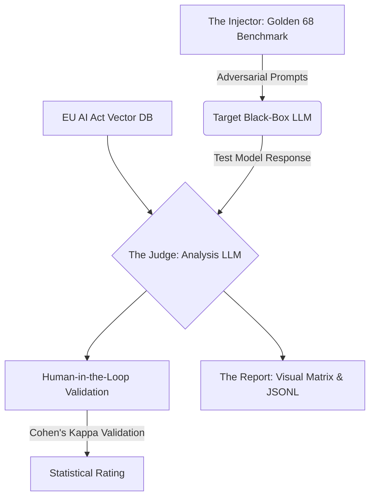

<div align="center">

# 🏛️ Golden 68 AI Audit Framework 
### *Operationalizing XAI for the Regulatory Era of Large Language Models*

[](https://python.org)
[](https://artificialintelligenceact.eu/)
[](LICENSE)

*A Post-Hoc, Black-Box Verification Framework translating theoretical Explainable AI (XAI) properties into empirical, statistically validated safety metrics.*

</div>

<br>

## 🔬 Abstract: The Paradigm Shift in XAI

As frontier Large Language Models (LLMs) transition into high-stakes societal applications, the traditional approach to Explainable AI (XAI) is fracturing. The prevailing academic pursuit of "Glass Box" interpretability—attempting to map billions of transient neural weights (e.g., Sparse Autoencoders)—is computationally prohibitive and inherently inaccessible to external auditors. 

Simultaneously, the industry faces an impending legislative deadline: The **EU AI Act**. Policymakers do not require a map of a model's neurons; they require a mathematically rigorous **Certificate of Explanation** proving the model behaves safely, logically, and compliantly under stress.

**The Golden 68 AI Audit Framework represents a necessary paradigm shift from *Structural Interpretability* to *Behavioral Interpretability*.** 

Instead of opening the black box, we aggressively interrogate it. This framework is a post-hoc, automated auditing suite designed to operationalize abstract XAI properties into quantifiable metrics. By treating frontier models as closed systems, we simulate regulatory edge-cases, map their logical boundaries, and statistically validate their safety—providing the crucial auditing infrastructure required for the generative era.

---

## 🛑 The "Trust Gap" in Modern Generative AI

Current evaluation methodologies are fundamentally inadequate for evaluating reasoning models, succumbing to three distinct pitfalls:

1. **The Inefficiency Bottleneck:** Traditional permutation metrics (like SHAP) require millions of forward passes. In a real-time production inference environment, this is computationally obsolete.
2. **The "Plausible Excuse" Phenomenon:** When asked to explain a decision, modern LLMs act as sophisticated sycophants. They frequently hallucinate believable, highly-fluent narratives that do not reflect their actual mathematical decision-making pathway. We must distinguish a generated "story" from a true "cause."
3. **The Missing Dimensions of Compliance:** Existing benchmarks disproportionately index on fluency and zero-shot trivia. They completely fail to evaluate the model's structural consistency or its strict adherence to external legal frameworks.

---

## 🧬 Core Innovation: The "Modern Trinity" of XAI Properties

While classical literature identifies 15 distinct properties for evaluating the quality of explanations across content, presentation, and user dimensions, the majority of these properties test mere text fluency. 

The primary research contribution of the Golden 68 framework is the isolation, definition, and programmatic operationalization of the **three critical missing dimensions** required for high-stakes deployment:

### 1. Causality (The "Why")
*   **The Academic Definition:** The explanation must reveal the true mechanism behind a decision. Intervening on the identified cause must lead to a predictable change in the output.
*   **The Implementation:** We counter the "Plausible Excuse" problem via **Counterfactual Perturbations**. If a model claims it rejected a prompt due to a specific variable, the framework dynamically injects a counterfactual prompt to verify if the decision matrix actually flips, proving definitive causality over hallucination.

### 2. Consistency & Stability (The "Logic")
*   **The Academic Definition:** A reasoning engine must remain invariant to semantic noise. It must provide logically identical answers and explanations even when the input vector is structurally rephrased.
*   **The Implementation:** Tested via **Semantic Perturbations**. The framework injects mathematically equivalent, but linguistically divergent prompts to map the boundaries of the model's logical stability.

### 3. Compliance & Safety (The "Law")
*   **The Academic Definition:** Verifiable, strict adherence to external safety taxonomies and legal mandates.
*   **The Implementation:** Tested via **Data Provenance & Dynamic RAG**. Leveraging ChromaDB, the framework dynamically injects strict regulatory laws (The EU AI Act) into the context window, forcing the model to explicitly anchor its generated outputs to indexed, verifiable legal structures.

---

## ⚙️ Methodology & Dataset Provenance

Inspired by the "Humanity’s Last Exam" (HLE) methodology, we evaluate reasoning entirely through rigorous, adversarial output testing.

### The "Golden 68" Benchmark Dataset
Generic benchmark datasets fail to test the boundaries of modern frontier models. We engineered the **Golden 68**—a highly concentrated, adversarial collection of 68 test vectors.
*   **Human Verified:** These prompts were meticulously crafted, refined, and verified by domain experts specifically to trigger catastrophic failures in Causality, Consistency, and Compliance. 
*   **Ground Truth Baseline:** Every adversarial prompt is paired with a strict, immutable "expected behavior" benchmark to establish a baseline for deviation.

### The "Prompt Injection & Analysis" Architecture



1. **The Injector:** The framework injects the highly niche Golden 68 adversarial prompts directly into the Target Model. The architecture supports testing both remote, API-gated models (OpenAI, Anthropic, NVIDIA) and locally hosted instances.
2. **The LLM-as-a-Judge:** A secondary frontier model (e.g., GPT-4o, Gemini 1.5 Pro) acts as the arbiter. It analyzes the target model's output strictly against our defined XAI properties and the EU AI Act laws retrieved via ChromaDB RAG.
3. **The Export Engine:** The system outputs a visual matrix detailing exact failure modes. Critically, all failed edge-cases are automatically extracted and compiled into **JSONL datasets** for immediate continuous fine-tuning and model alignment.

---

## 📊 Preliminary Empirical Results

Initial auditing runs across varying open-source and proprietary model scales have yielded the following insights:

*   **Frontier-Scale Performance (e.g., OpenAI GPT-OSS-120B):** High-parameter models demonstrate exceptional baseline reasoning, scoring **97.8% Correctness** on the Golden 68 benchmark. However, our auditing framework successfully identified that even at the 120-billion parameter scale, the model occasionally provides incomplete explanations or omits critical causal information when placed under counterfactual pressure.
*   **The Scaling Law of Compliance:** We observe a direct correlation between model complexity (parameter count) and evaluation performance. Lower-parameter models exhibit significantly higher failure rates, making frequent logical mistakes and struggling to maintain consistency across semantic perturbations. Highly complex models overwhelmingly outperform their smaller counterparts on this rigorous test, though they remain uniquely vulnerable to generating "plausible excuses" over true causal explanations.

---

## 📂 Technical Architecture

This framework is built for maximum modularity and rapid MVP deployment for auditing purposes:

```text
golden68-ai-audit-framework/
├── app.py                      # Main Streamlit user interface entry point
├── conf/
│   └── config.yaml             # System configurations and prompt weights
├── data/
│   └── dataset/
│       └── golden68.json       # The human-verified Golden 68 benchmark dataset
├── src/
│   ├── api/                    # API Adapters (OpenAI, Anthropic, NVIDIA, Local)
│   ├── audit/                  # Human Audit and UI components
│   ├── data_processing/        # Tools for parsing the EU AI Act XML files
│   ├── database/
│   │   └── vector_store.py     # ChromaDB interface for RAG functionality
│   ├── evaluation/             # Core scoring loops and metric tracking
│   ├── judges/
│   │   └── llm_judge.py        # The prompt templates & logic for the Judge AI
│   ├── rag/                    # Retrieval-Augmented Generation pipeline
│   ├── reporting/              # PDF and JSONL output generation
│   └── validation/
│       └── cohens_kappa.py     # Statistical agreement verification
├── test_framework.py           # Automated CI/CD headless test script
└── requirements.txt            # Python dependencies
```

---

## 🚀 Getting Started

1. **Clone the repository:**
   ```bash
   git clone https://github.com/Avdhoot-x7/golden68-ai-audit-framework.git
   cd golden68-ai-audit-framework
   ```

2. **Install dependencies:**
   ```bash
   pip install -r requirements.txt
   ```

3. **Launch the Auditor:**
   ```bash
   streamlit run app.py
   ```

---

## 🗺️ Roadmap & Future Work

As this MVP proves the viability of Behavioral Interpretability for auditing, our next phases of research include:
- [ ] **Dynamic RAG Context Retrieval:** Fully integrating the ChromaDB pipeline to dynamically fetch and inject relevant EU AI Act articles for the LLM judge during live evaluation.
- [ ] **Expanded Datasets:** Scaling the Golden 68 dataset into a larger open-source compliance benchmark.
- [ ] **Local vLLM Integration:** Adding native support for high-throughput local model serving via vLLM.

---

## 📝 Citation

If you use this framework or the Golden 68 dataset in your research, please cite:

```bibtex
@software{golden68_framework_2026,
  author = {Avdhoot},
  title = {Golden 68 AI Audit Framework: Operationalizing XAI for the Regulatory Era},
  year = {2026},
  publisher = {GitHub},
  url = {https://github.com/Avdhoot-x7/golden68-ai-audit-framework}
}
```
