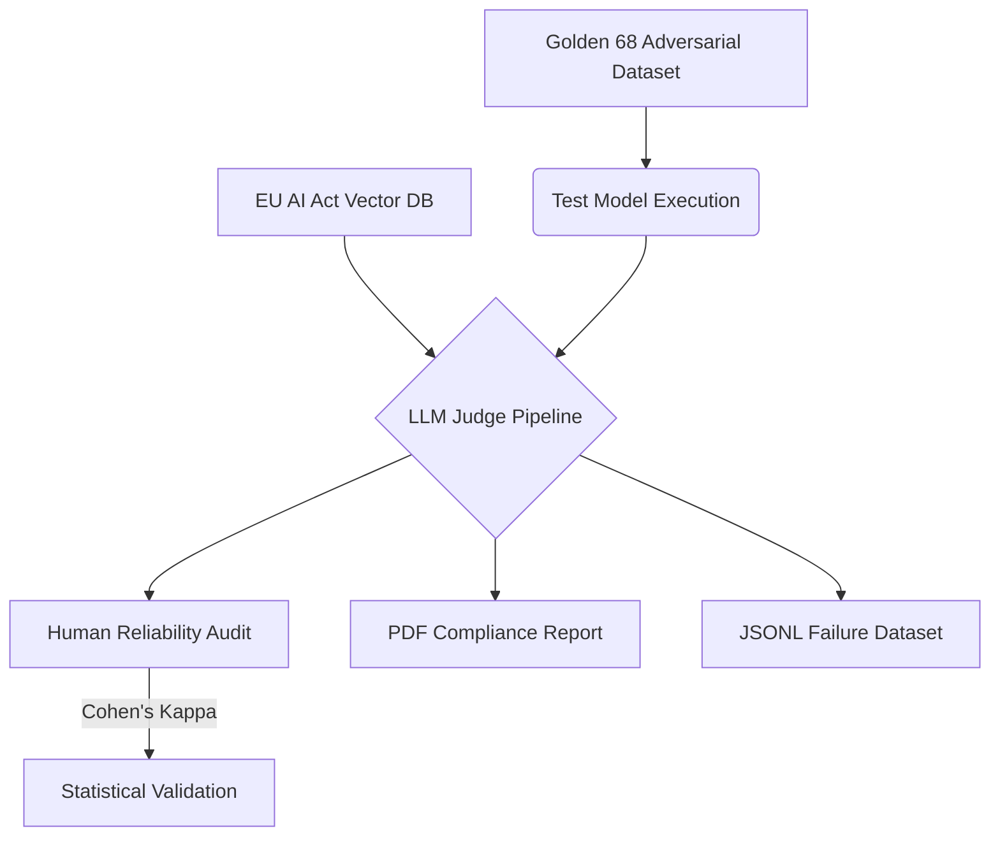

<div align="center">

# 🏛️ Golden 68 AI Audit Framework 
### *Enterprise-Grade LLM Evaluation & Regulatory Compliance Pipeline*

[](https://python.org)
[](https://artificialintelligenceact.eu/)
[](LICENSE)
[]()

*Bridging the gap between frontier LLMs and high-stakes deployment through rigorous, statistically proven safety auditing.*

</div>

<br>

## 📌 The Vision

As Large Language Models (LLMs) transition from conversational agents to the core "brains" of high-stakes, real-world applications, empirical safety testing is no longer optional—it is a legal mandate. 

The **Golden 68 AI Audit Framework** is a premier open-source tool designed to rigorously filter and evaluate text-to-text base LLMs. Our objective is to provide a standardized, mathematically reliable testing ground for AI models to ensure absolute adherence to the **European Union AI Act** before its final enforcement date.

This framework does not just test if a model is "smart"; it tests if a model is **safe, logically consistent, and legally compliant.**

---

## 🏗️ System Architecture & Workflow

We employ a highly structured **LLM-as-a-Judge** pipeline, mathematically validated by Human-in-the-Loop oversight. 



### 1. 🛡️ The "Golden 68" Adversarial Dataset
At the heart of the framework lies the **Golden 68**—a highly effective, meticulously crafted dataset engineered by both AI researchers and human domain experts. It is designed to inject edge cases, manipulate base alignments, and rigorously test a model's causality and explanations against a ground-truth expected behavior.

### 2. ⚖️ Dynamic Regulatory Context (RAG)
To guarantee legal compliance, the framework integrates a **Semantic Vector Store (ChromaDB)** indexed with the EU AI Act laws. Rather than relying on a model's latent memory, the framework dynamically retrieves and injects the specific legal articles relevant to the current prompt, forcing the Judge to evaluate strictly by the book.

### 3. 🧠 The "LLM-as-a-Judge"
The framework utilizes frontier models (e.g., Gemini 1.5 Pro, GPT-4o) as the definitive Judge. The Judge is fed the test model's response, the ground-truth baseline, and the EU AI Act strictures. It outputs a definitive 1-10 rating alongside a robust chain-of-thought explanation.

### 4. 🧑‍🔬 Human Reliability & Cohen's Kappa
To eliminate Judge hallucinations, human researchers perform parallel blind-grading. The framework calculates the **Cohen's Kappa** statistical metric between the AI Judge and the Human Auditor, mathematically proving the reliability of the automated evaluation.

### 5. 🔄 The Feedback Loop (Continuous Improvement)
Audits are useless without actionable data. The framework automatically compiles all failed edge-cases into perfectly formatted **JSONL Datasets**. AI companies can immediately ingest these files to fine-tune and continuously align their models.

---

## ✨ Technical Features

*   **Multi-Provider Adapters:** Native, seamless integration with **NVIDIA NGC, OpenAI, Anthropic, and OpenRouter** APIs.
*   **Bulletproof Parsing:** Robust internal error handling and safe-parsing to prevent pipeline crashes during massive evaluation runs.
*   **Automated PDF Reporting:** Instantly generate beautiful, executive-ready PDF audit reports detailing compliance heatmaps and vulnerability areas.
*   **Persistent Storage:** Local ChromaDB integration securely stores all historical evaluations and dataset hashes.

---

## 🚀 Quickstart Guide

1. **Clone the repository:**
   ```bash
   git clone https://github.com/Avdhoot-x7/golden68-ai-audit-framework.git
   cd golden68-ai-audit-framework
   ```

2. **Install dependencies:**
   ```bash
   pip install -r requirements.txt
   ```

3. **Launch the Evaluation Interface:**
   ```bash
   streamlit run app.py
   ```
4. Configure your API keys in the dashboard and begin your compliance audit.

---

## 🤝 Contributing

We are in a race against time before the final declaration date of the EU AI Act. We actively welcome contributions from researchers, policymakers, and engineers to expand the Golden 68 dataset and fortify the evaluation rubrics. 

Please open an issue or submit a Pull Request to get involved.

---

<div align="center">
  <i>Ensuring the AI of tomorrow is safe to use today.</i>
</div>
